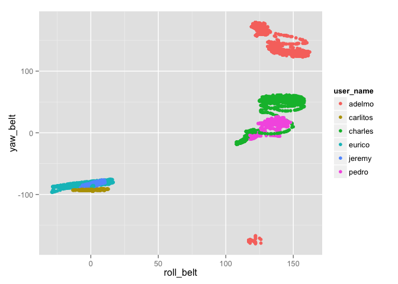

# Quantifying the Quality of Weight Lifting Exercises With Sensor Data
Hsing Liu  
September 13, 2014  

<!--
To knit this RMD file, run:
knit2html("project_writeup.Rmd");browseURL("project_writeup.html")
-->

### Project Description

The goal of this project is to classify the manner in which barbell lifts are performed.  The supplied data contains sensor measurements from six subjects each performing barbell lifts in five different ways, one correctly (labeled classe="A") and four incorrectly (B~E).  The complete description of the study is available at <http://groupware.les.inf.puc-rio.br/har>, and the data set is [here](https://d396qusza40orc.cloudfront.net/predmachlearn/pml-training.csv).

A machine learning model is trained using the above data set, and applied to a separate test set of 20 cases, which can be found [here](https://d396qusza40orc.cloudfront.net/predmachlearn/pml-testing.csv).

### Feature Selection and Preprocessing

R package `caret` is used for model training, and `ggplot2` is used for exploratory plotting.


```r
library(caret)
```

```
## Loading required package: lattice
## Loading required package: ggplot2
```

```r
library(ggplot2)
```

First, the data sets are downloaded and placed in R's working directory.  Load the data sets as follows:


```r
training <- read.csv("pml-training.csv", na.strings=c("NA", ""))
testing <- read.csv("pml-testing.csv", na.strings=c("NA", ""))
dim(training)
```

```
## [1] 19622   160
```

```r
dim(testing)
```

```
## [1]  20 160
```

By manually examining the data as well as referring to the paper associated with the data source, we can see that the data consists of segments of continuous time series of sensor measurements, divided into around 400 "windows."  At the end of each window, statistical summaries such as min, max, mean and variance are calculated for each measurement over this period.

The first consequence of this data structure is the apparent large portion of NA data in the columns with summary variables.  Otherwise, the data is very clean and well structured.  The second consequence is that we'll be building our prediction model quite differently compared to the original study.  This is because in the original study, these summary variables are the primary features that are used to classify movement.  In our case however, since the testing data set does not provide these summary variables, we'll be ignoring them.

Removing these columns is straight forward because only they contain NA's:


```r
na_counts <- colSums(is.na(training))
table(na_counts)
```

```
## na_counts
##     0 19216 
##    60   100
```

```r
train_sel <- training[, na_counts == 0]
colnames(train_sel)
```

```
##  [1] "X"                    "user_name"            "raw_timestamp_part_1"
##  [4] "raw_timestamp_part_2" "cvtd_timestamp"       "new_window"          
##  [7] "num_window"           "roll_belt"            "pitch_belt"          
## [10] "yaw_belt"             "total_accel_belt"     "gyros_belt_x"        
## [13] "gyros_belt_y"         "gyros_belt_z"         "accel_belt_x"        
## [16] "accel_belt_y"         "accel_belt_z"         "magnet_belt_x"       
## [19] "magnet_belt_y"        "magnet_belt_z"        "roll_arm"            
## [22] "pitch_arm"            "yaw_arm"              "total_accel_arm"     
## [25] "gyros_arm_x"          "gyros_arm_y"          "gyros_arm_z"         
## [28] "accel_arm_x"          "accel_arm_y"          "accel_arm_z"         
## [31] "magnet_arm_x"         "magnet_arm_y"         "magnet_arm_z"        
## [34] "roll_dumbbell"        "pitch_dumbbell"       "yaw_dumbbell"        
## [37] "total_accel_dumbbell" "gyros_dumbbell_x"     "gyros_dumbbell_y"    
## [40] "gyros_dumbbell_z"     "accel_dumbbell_x"     "accel_dumbbell_y"    
## [43] "accel_dumbbell_z"     "magnet_dumbbell_x"    "magnet_dumbbell_y"   
## [46] "magnet_dumbbell_z"    "roll_forearm"         "pitch_forearm"       
## [49] "yaw_forearm"          "total_accel_forearm"  "gyros_forearm_x"     
## [52] "gyros_forearm_y"      "gyros_forearm_z"      "accel_forearm_x"     
## [55] "accel_forearm_y"      "accel_forearm_z"      "magnet_forearm_x"    
## [58] "magnet_forearm_y"     "magnet_forearm_z"     "classe"
```

A few more columns are of no use to us, such as the timestamp and window data.


```r
train_sel <- train_sel[, -c(1, 3:7)]        # X, timestamp, window
dim(train_sel)
```

```
## [1] 19622    54
```

At this point we're left with 54 columns.  We might consider removing user_name also, but it is unclear whether that is appropriate:


```r
qplot(roll_belt, yaw_belt, data=train_sel, color=user_name)
```

 

From the plot above it appears that each user might execute the motions quite differently, but it also suggests that the difference between users might already be well-encoded by other data.  We'll keep this column for now.

### Model Fitting Using Random Forest

The first machine learning model fitted was random forest.  It also turned out to have the highest accuracy and was applied to the final test cases.

Using the `caret` package, we can automate the out of sample error estimate by setting the train control parameters.  This is done with `trainControl(method="cv")` which defaults to doing a single iteration of K-fold cross-validation, K=10.

To keep the training time reasonable, the option `tuneLength=1` is included.  By default, caret would automatically select several tuning parameters, repeat model fitting for each, going through K-fold cross-validation every time and select the parameter with the lowest estimated error.  In the case of random forest, this parameter is called `mtry`, which is the number of variables sampled at each split.  Caret normally picks 3 different `mtry` values, but experimentations showed that this parameter tend to not have a significant effect on accuracy, so we'll limit caret to use only one default value.


```
## randomForest 4.6-10
## Type rfNews() to see new features/changes/bug fixes.
```


```r
ctrl <- trainControl(method="cv")
fit_rf <- train(classe ~ ., data=train_sel, method="rf",
                trControl=ctrl, tuneLength=1)
```


```r
fit_rf
```

```
## Random Forest 
## 
## 19622 samples
##    53 predictors
##     5 classes: 'A', 'B', 'C', 'D', 'E' 
## 
## No pre-processing
## Resampling: Cross-Validated (10 fold) 
## 
## Summary of sample sizes: 17660, 17662, 17658, 17662, 17660, 17658, ... 
## 
## Resampling results
## 
##   Accuracy  Kappa  Accuracy SD  Kappa SD
##   1         1      0.001        0.002   
## 
## Tuning parameter 'mtry' was held constant at a value of 7
## 
```

```r
fit_rf$finalModel
```

```
## 
## Call:
##  randomForest(x = x, y = y, mtry = param$mtry) 
##                Type of random forest: classification
##                      Number of trees: 500
## No. of variables tried at each split: 7
## 
##         OOB estimate of  error rate: 0.3%
## Confusion matrix:
##      A    B    C    D    E class.error
## A 5578    1    0    0    1   0.0003584
## B   10 3783    4    0    0   0.0036871
## C    0   15 3407    0    0   0.0043834
## D    0    0   20 3193    3   0.0071517
## E    0    0    2    3 3602   0.0013862
```

Other methods attempted include basic tree (rpart), SVM and some boosting methods.  While SVM achieved 95% accuracy, the other methods did not produce any reasonable result (perhaps not set up correctly), so they are not included in this writeup.

### Out of Sample Error Estimate

The final random forest is shown to have 500 trees, 7 variables tried at each split, and a remarkable out-of-bag error estimate of 0.28%, using 10-fold cross-validation.

An alternative way to get un unbiased OOB estimate for random forest is to specify `trainControl(method="oob")`, which will run much quicker than K-fold CV.  See [This page](http://www.stat.berkeley.edu/~breiman/RandomForests/cc_home.htm#ooberr) for more information.

### Variable Importance

The random forest model contains information on the relevance/importance of each variable, which allows us to revisit the question at the beginning, whether user name should be kept.


```r
decrease_gini <- importance(fit_rf$finalModel)
decrease_gini[order(-decrease_gini), ,drop=F]
```

```
##                      MeanDecreaseGini
## roll_belt                     1228.76
## yaw_belt                       892.70
## pitch_forearm                  736.31
## magnet_dumbbell_z              728.03
## pitch_belt                     696.19
## magnet_dumbbell_y              671.11
## roll_forearm                   594.30
## magnet_dumbbell_x              476.60
## accel_dumbbell_y               411.09
## roll_dumbbell                  409.82
## accel_belt_z                   393.76
## magnet_belt_y                  383.05
## magnet_belt_z                  382.30
## accel_dumbbell_z               330.99
## roll_arm                       319.74
## accel_forearm_x                319.06
## gyros_belt_z                   299.36
## magnet_forearm_z               280.59
## gyros_dumbbell_y               274.56
## magnet_arm_x                   261.27
## yaw_arm                        257.65
## yaw_dumbbell                   256.67
## total_accel_dumbbell           253.42
## magnet_belt_x                  249.52
## accel_arm_x                    248.32
## accel_dumbbell_x               241.67
## accel_forearm_z                229.93
## magnet_forearm_x               228.33
## magnet_arm_y                   227.23
## magnet_forearm_y               223.25
## total_accel_belt               216.55
## magnet_arm_z                   187.09
## pitch_dumbbell                 180.89
## pitch_arm                      173.04
## yaw_forearm                    170.15
## accel_arm_y                    152.12
## accel_forearm_y                145.24
## gyros_arm_x                    139.21
## gyros_arm_y                    137.13
## gyros_dumbbell_x               133.89
## accel_arm_z                    132.17
## gyros_forearm_y                126.79
## accel_belt_y                   119.25
## accel_belt_x                   117.67
## gyros_belt_y                   110.79
## total_accel_forearm            110.16
## total_accel_arm                103.16
## gyros_belt_x                    99.36
## gyros_dumbbell_z                86.50
## gyros_forearm_z                 84.50
## gyros_forearm_x                 75.01
## user_nameeurico                 67.10
## gyros_arm_z                     54.75
## user_namecharles                31.65
## user_namecarlitos               24.17
## user_namejeremy                 18.49
## user_namepedro                  10.04
```

This shows that user_name contributes little to the model, and can perhaps be safely ignored.

### Test Cases Prediction

Here the trained model is applied to the test cases.  The test set data first needs to be
pre-processed the same way.


```r
test_sel <- testing[, na_counts == 0]
test_sel <- test_sel[, -c(1, 3:7)]
predict(fit_rf, test_sel)
```

```
##  [1] B A B A A E D B A A B C B A E E A B B B
## Levels: A B C D E
```
